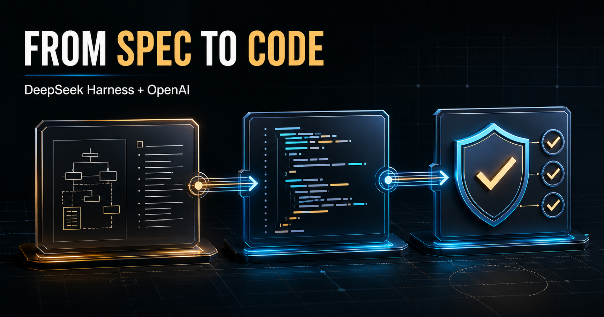

# DeepSeek Harness SDD Code Agent



Um starter kit para transformar o [DeepSeek Harness](https://github.com/deepseek-ai/deepseek-harness) em um agente de engenharia orientado por especificação.

O fluxo usa modelos diferentes por responsabilidade:

| Etapa | Modelo | Esforço | Saída obrigatória |
|---|---|---:|---|
| Arquitetura, plano e spec | `gpt-5.5` | `xhigh` | `docs/sdd/PLAN.md`, `SPEC.md` e `status.json` |
| Implementação e testes | `gpt-5.3-codex` | `high` | Código funcional e testes |
| Verificação e correções | `gpt-5.5` | `xhigh` | `docs/sdd/VERIFICATION.md` |

O Harness coordena os estágios com seu recurso de workflows. Cada subagente trabalha no mesmo repositório, mas recebe um modelo e um contrato de saída específicos.

> Validado contra `@deepseek-ai/dsh@0.1.1-rc.2` e o commit `b150a551b8d465e31e418e1b2eaf5e79bbb7d28e` do DeepSeek Harness. O projeto upstream está em developer preview; atualize a versão conscientemente e rode novamente a validação após upgrades.

## Pré-requisitos

- macOS ou Linux;
- Node.js `22.19+` ou `24+`;
- uma chave da OpenAI API com acesso aos modelos configurados;
- um repositório Git contendo o código que o agente poderá modificar.

Uma assinatura do ChatGPT não inclui automaticamente créditos da API. A disponibilidade dos modelos depende da sua conta e região.

## Quick start

```bash
git clone <URL-DO-SEU-REPOSITORIO>
cd deepseek-harness-sdd-agent
cp .env.example .env
# Edite .env e informe OPENAI_API_KEY.
./scripts/bootstrap.sh
./scripts/launch.sh
```

No navegador:

1. Abra o workspace deste repositório.
2. Selecione o preset **Code**.
3. Inicie uma nova sessão.
4. Peça: `Use a skill sdd-code-agent para implementar examples/sample-request.md`.
5. Confirme que o agente carregou a skill e chamou o tool `workflow`.

Para iniciar sem abrir automaticamente o navegador, use `./scripts/launch.sh --no-open`.

O fluxo esperado é:

```text
pedido do usuário
      ↓
GPT-5.5 xhigh ── plano + spec + readiness gate
      ↓
GPT-5.3-Codex high ── implementação + testes
      ↓
GPT-5.5 xhigh ── revisão independente + correções + evidência
```

## Como a configuração funciona

- `config/settings.yaml` declara duas rotas OpenAI. Cada rota fixa um reasoning effort padrão, pois o workflow do Harness aceita `provider` e `model` por subagente, mas não recebe `effort` diretamente.
- `.dsh/skills/sdd-code-agent/SKILL.md` contém o contrato SDD e o script de orquestração.
- `AGENTS.md` é a política permanente do agente para este repositório.
- `.dsh-home/` é criado localmente e ignorado pelo Git; guarda a configuração de runtime.
- A chave fica apenas em `.env` ou no ambiente. Ela nunca deve ser commitada.

## Usando o kit dentro de outro projeto

Copie estes itens para a raiz do projeto alvo:

```text
.dsh/skills/sdd-code-agent/
config/settings.yaml
scripts/bootstrap.sh
scripts/launch.sh
scripts/validate.mjs
AGENTS.md
.env.example
```

Se o projeto já tiver um `AGENTS.md`, mescle as políticas em vez de sobrescrever o arquivo.

## Quality gates

O agente deve:

1. inspecionar código e convenções existentes antes de propor mudanças;
2. escrever uma spec decision-complete, com cenários de erro e critérios de aceite;
3. implementar somente quando `docs/sdd/status.json` declarar `ready`;
4. adicionar ou atualizar testes junto com mudanças de comportamento;
5. executar os menores checks que provem a mudança;
6. revisar o diff e corrigir problemas encontrados;
7. registrar comandos e resultados reais em `VERIFICATION.md`.

Valide o starter kit com:

```bash
npm test
```

## Segurança

- Rode o Harness somente em repositórios que você aceita que um agente modifique.
- Revise permissões e comandos destrutivos antes de aprová-los.
- Nunca coloque chaves em prompts, commits, screenshots ou logs.
- Faça commits pequenos antes de tarefas grandes para facilitar inspeção e rollback.
- Proteja branches principais com pull requests e CI.

## Conteúdo para publicação

- Tutorial completo: [TUTORIAL_LINKEDIN.md](TUTORIAL_LINKEDIN.md)
- Post curto: [LINKEDIN_POST.md](LINKEDIN_POST.md)
- Capa horizontal: [assets/linkedin-cover.png](assets/linkedin-cover.png)
- Exemplo de pedido: [examples/sample-request.md](examples/sample-request.md)

## Fontes

- [DeepSeek Harness](https://github.com/deepseek-ai/deepseek-harness)
- [Documentação de providers do DeepSeek Harness](https://github.com/deepseek-ai/deepseek-harness/blob/master/docs/user/guide/providers.md)
- [Modelos da OpenAI](https://developers.openai.com/api/docs/models)
- [GPT-5.5](https://developers.openai.com/api/docs/models/gpt-5.5)
- [GPT-5.3-Codex](https://developers.openai.com/api/docs/models/gpt-5.3-codex)

## Licença

MIT. Veja [LICENSE](LICENSE).
